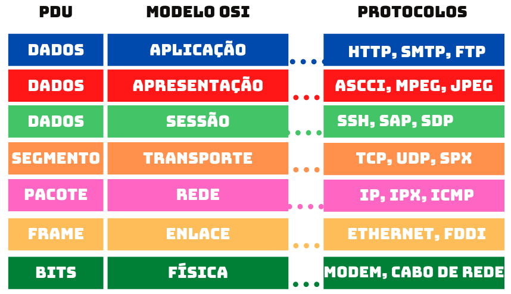

# Segurança de software

## Introdução

- Motivos:
  - fim dos limites físicos - necessidade de melhoria na segurança de códigos em nuvem
  - LGPD - segurança de dados
  - Poderes dentro da infra -> autorização e limitações de usuários
  
- Principais riscos
  - Ataques hackers
  - Vazamento de dados
  - Ataquies de Pishing
    - engrenharia social para enganar a vítima e roubar dados
  - Malware
    - se aproveita de vulnerabilidades em aplicações para instalar programas maliciosos
    - podem causar danos ao sistema, como perda de dados
  
- Risco ocorre por 3 causas:
  - Capacidade de explorar
  - Iniciativa para explorar
  - Oportunidade para explorar
    - Portão da casa está fechado -> falta oportunidade
    - Capacidade e iniciativa -> pula o portão
    - Portão da casa está aberto -> oportunidade
    - Iniciativa -> não entra porque não tem iniciativa

- Principais organizações:
  - ISO - padrões de normas de mercado
  - W3C - padronização de estruturas de sites, protocolos HTTP , de criptografia, CSS...
  - OWASP - 10 principais vulnerabilidades no desenvolvimento de software
  - NIST - agência do governo dos EUA que padroniza segurança cibernética
  - IETF - padrões de criptografia
  - PCI SSC - padrão de pagamentos e criptografia de dados de cartões de crédito

## criptografia

- O que é?
  - Transformar algo legível em ilegível
  - Envolve algorítmos matemáticos complexos

- Como funciona?
  - Chaves criptográficas
  - Cifras simétricas e assimétricas

- Onde é usado?
  - Armazenar e transferir dados em sigilo
  - Comunicações seguras, transações financeiras, proteção de dados pesosais, segurança cibernética

### Criptografia simétrica

- AES
- Mesma chave nas 2 pontas
- Mais rápido
- Chave única pode ser exposta e comprometer a segurança

### Criptografia assimétrica

- RSA
- 2 chaves diferentes para criptografar e descriptografar
- Pública -> distribuída, privada -> segredo
- Maior segurança
- Permite verificação de remetente

- Assinatura digital
  - Esquema matemático para verificar auitenticidade de docs e mensagens

### Funções hash

- SMA256
- Utiliza algoritmo para transformar mensagem em string de caracteres fixa
- Não precisa de chave para descriptografar
- Uso principal: verificar integridade de dados

### Transmissão e armazenamento de dados

- Criptografia para:
  - dados em repouso (BitLocker - HD)
  - dados em movimento (HTTPS, TLS, VPNs)

- Gerenciamento de chaves:
  - vaults
  - local de armazenamento seguro de chaves
  - facilita gestão de ciclo de vida

- Prevenção de ataques:
  - salting: adicionar sequência aleatória de caracteres a uma string e armazenar senha com salting
  - hashing: normalmente utilizado junto com salting. Converte bloco de dados em valor de comprimento fixo

- Teste e auditoria:
  - garantir que implementações criptográficas continuem seguras
  - testes de penetração, revisão de código, auditoria de terceiros

### Padrões de criptografia

- AES
  - rápido  
  - muito utilizado
  - 1 chave

- RSA
  - específica para Assinatura
  - 2 chaves
  - chave pública garante auitenticidade

- SHA 
  - resistente a colisões (muito improvável 2 mensagens gerarem a mesma impressão digital)
  - não reversibilidade (praticamente impossível reverter o processo e recuperar a mensagem original)

## Protocolos de comunicação segura

- Modelos de referência OSI
  - define 7 camadas que descrevem como os dispositivos se comunicam entre si.
  - camadas independentes que trabalham entre si
  

### Principais protocolos

- TCP/IP
- HTTP/S
- FTP/S
- SMTP
- DNS
- LIBSIGNAL

## Segurança no desenvolvimento de software

### Desafios:
- identificar riscos e vulnerabilidades
- gerenciar vulnerabilidades e riscos
- integrar da segurança no processo de desenvolvimento
- treinamentos e conscientização dos desenvolvedores

### Ciclo de vida:
- planejamento e definição dos requisitos de segurança
  - identificar ativos, analisar riscos, requisitos, políticas e testes
- projeto e implementação seguros 
  - spoofing, tampering, repudiation, information disclousure, denial of service, elevation of privilage
- testes de segurança e avaliação de vulnerabilidades
- implementação e manutenção seguras (configuração do servidor, autenticação e autorização, monitoramento)

### Métodos e ferramentas:
- análise de código estático(build)(funções inseguras, var não iniciadas, vulnerabilidades de buffer overflow) e dinâmico(código executado)(injeções de SQL, ataques buffer overflow ...)
- testes de invasão e avaliação de vulnerabilidades
- gerenciamento de configurações segura
- autenticação e autorização
  - SSO: cria tolkien para não ter que reautenticar sempre que acessa um app diferente (login com google)
  - protocolos: O Auth, open ID Connect e JWT
  - controle de permissões
  - monitoramento de tentativas de acesso
  - atualização
- criptografia e gerenciamento de chaves
- monitoramento e detecção de incidentes

## Autenticação e autorização

- Autenticação: 
  - validar identidade
  - senha, smart cards, biometria
  - validação de identidade: saber, possuir, ser -> unir 2 para melhorar autenticação

- Autorização:
  - permissão de acesso
  - granularidade, flexibilidade
  - função da pessoa ou regra do negócio

